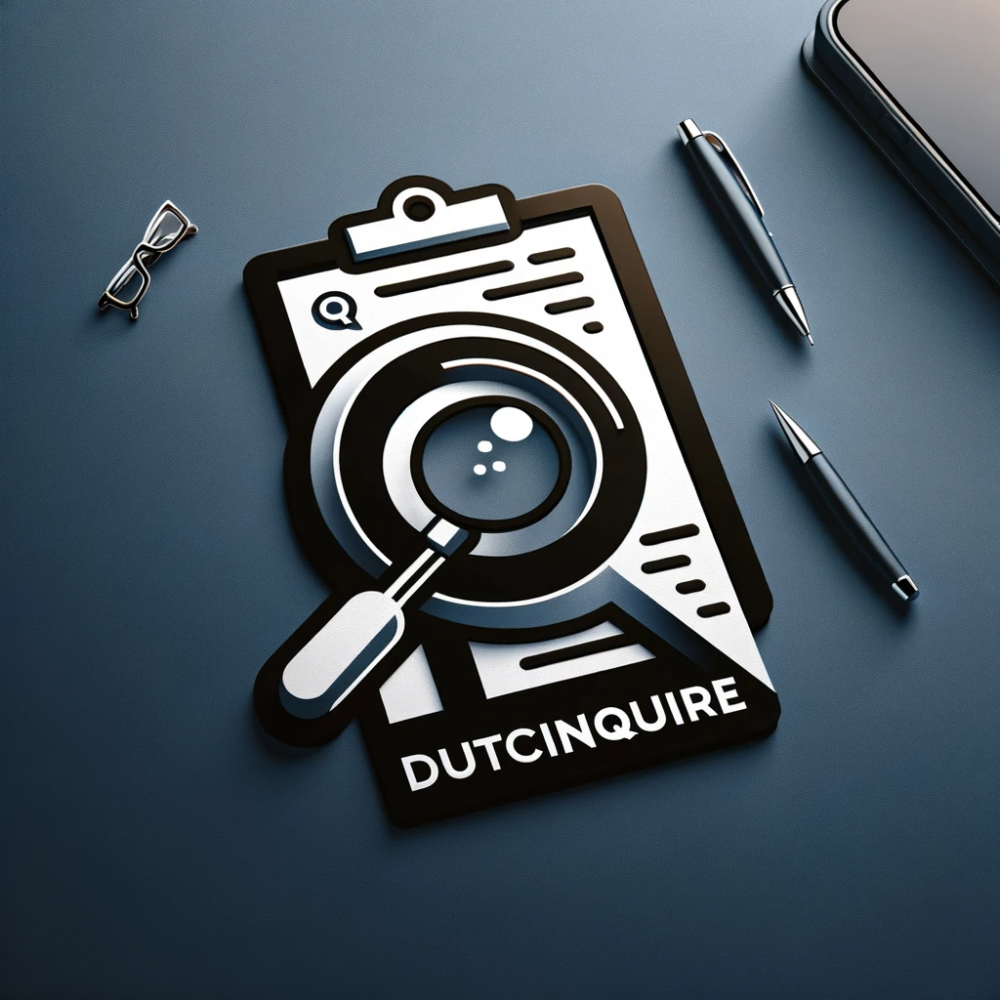

# DutchInquire: Dutch Document Analyzer

DutchInquire is a Streamlit-powered application designed to analyze Dutch documents and provide insights in English. It uses Google's Gemini Pro Vision model for processing and is deployed on [HuggingFace Spaces](https://huggingface.co/spaces/thecr7guy/DutchInquire).



## Features

- Analyze images of Dutch documents.
- Convert analysis into English responses.
- User-friendly interface for uploading documents and receiving responses.

## Local Setup with Docker

### Prerequisites

- Docker installed on your system.

### Building the Docker Container

**Clone the Repository**: Clone the repository containing the Dockerfile and Python script.
**Build the Docker Image**:
```bash 
docker build -t dutchinquire 
```
This command builds the Docker image with the tag `dutchinquire`.

**Run the Docker Container**:
```bash 
docker run -p 7860:7860 dutchinquire
```
This makes the app available at `http://localhost:7860`.

### Dockerfile Breakdown

- The Dockerfile uses `python:3.10.13-slim` as a base image.
- It installs `pipenv` for dependency management.
- The application is set up in the `/app` directory inside the container.
- The `Pipfile` and `Pipfile.lock` are copied and dependencies are installed.
- The `app.py` file (containing the Streamlit app) is copied into the container.
- The container exposes port 7860.
- The CMD directive specifies how Streamlit should run the app.

## Usage

1. Open your web browser and navigate to `http://localhost:7860`.
2. Upload an image file of a Dutch document.
3. Enter your query in the provided text box.
4. Click "Ask Now" to receive the analysis.

## Prompt tha GEMINI PRO Vision uses 
GPT-4 was used to generate a detailed input_prompt.

```bash

input_prompt = """

Hello Gemini, you are an expert in analyzing and extracting information from Dutch language documents. Your task is to interpret the content of a Dutch document provided to you and answer questions about it in English with precision and clarity.

When presented with a Dutch document, you should first thoroughly analyze its content, considering the context, the main themes, specific details, and any nuances in the language. Your understanding of Dutch should enable you to grasp both literal meanings and subtleties such as idiomatic expressions or cultural references.

Once you've processed the document, you will be asked questions in English regarding its content. These questions may range from seeking summaries of the document to asking for specific details or explanations of certain parts. Your responses should be in English, articulated in a way that is easy for a non-Dutch-speaking audience to understand.

Please keep in mind that accuracy is crucial, so your responses should reflect a precise understanding of the Dutch document. Additionally, maintain a neutral and informative tone, focusing on delivering factual and clear answers.

"""

```


## Deployment on Hugging Face Spaces

- The application is also deployed on [HuggingFace Spaces](https://huggingface.co/spaces/thecr7guy/DutchInquire), providing an easy-to-access web interface for users.


